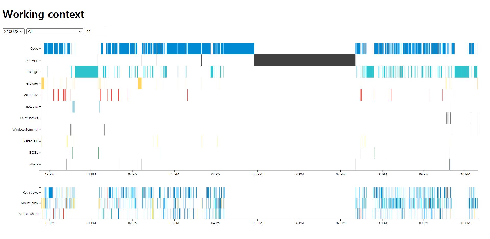
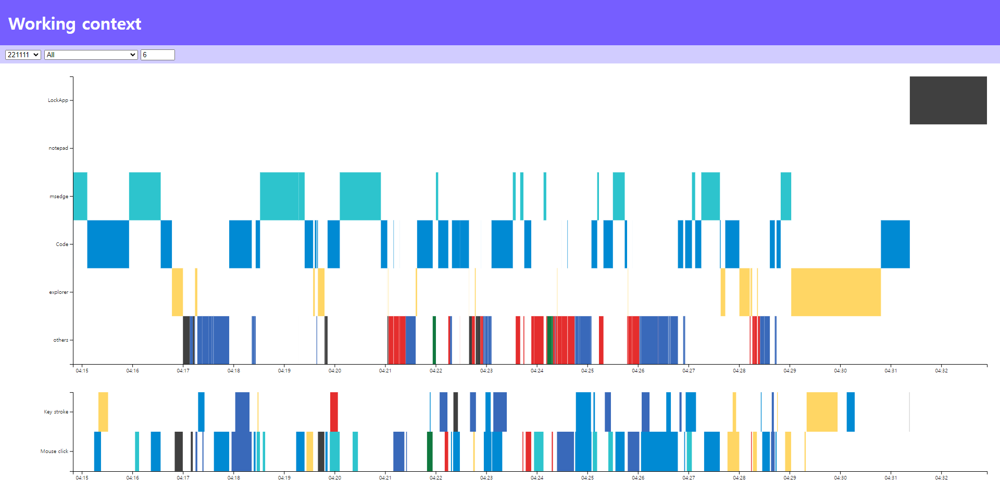
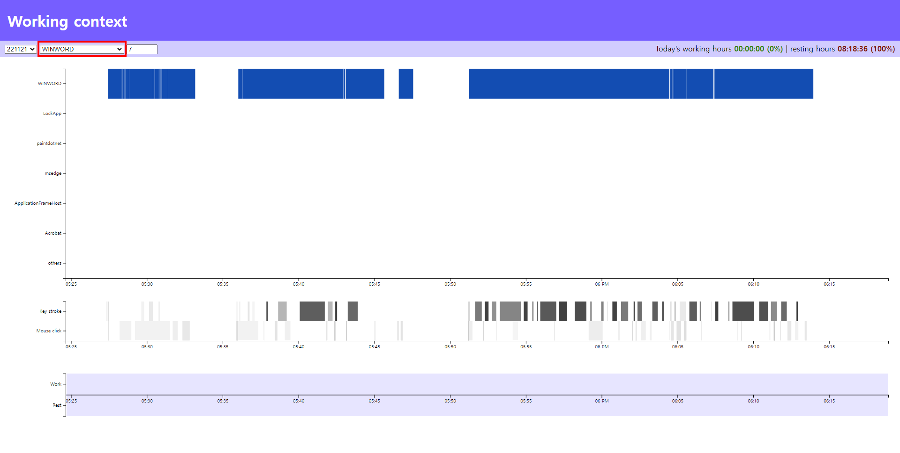

# Working Context

## How to use
* Put your "WorkingContext.csv" in the same directory as "WorkingContext.html".
  * You can collect your own "WorkingContext.csv" data from [ChordingCoding@v.1.6](https://github.com/salt26/chordingcoding/tree/v.1.6)
* Start terminal.
* Type `npx live-server --open="./WorkingContext.html"`
* Explore your data.

