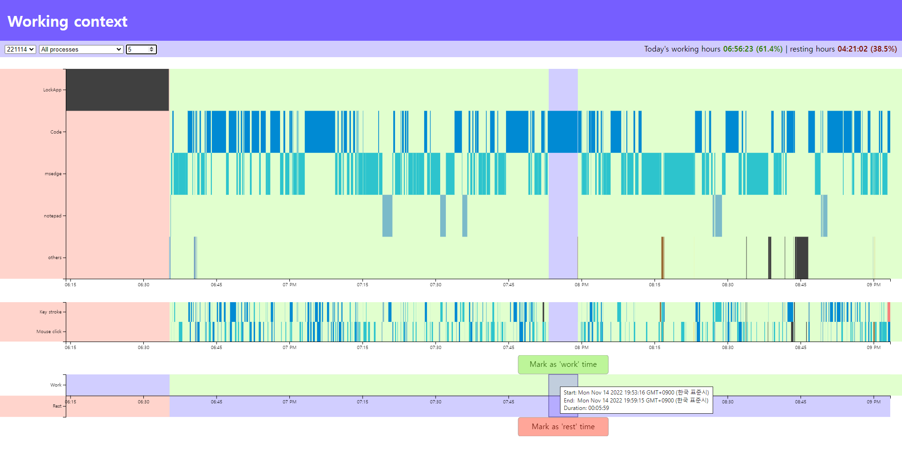

# Working Context

## How to use
* Put your `ChordingCoding_context_log_YYMMDD.csv` in the `./Data/` directory.
  * You can collect your own `ChordingCoding_context_log_YYMMDD.csv` data from [ChordingCoding@v.1.8.3](https://github.com/salt26/chordingcoding/tree/v.1.8.3)
* Add the following code below the 265th line of `WorkingContext.html`.
  * `{'filename': './Data/ChordingCoding_context_log_YYMMDD.csv'},`
  * Change `YYMMDD` to match the date you collected the data.
* Start terminal.
* Type `npx live-server --open="./WorkingContext.html"`
* Explore your data.
  * Full screen mode is recommended.

